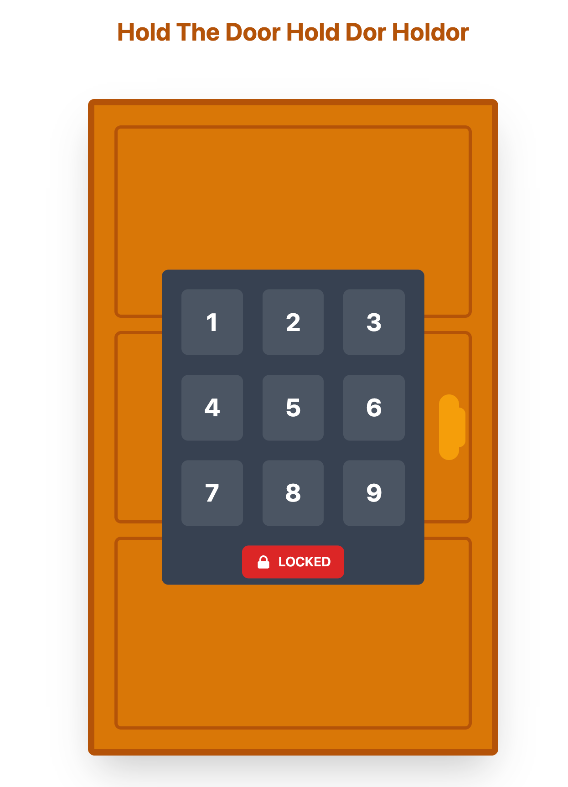

# DoorLock

Demo app showcasing OTP's `:gen_statem` behaviour together with fault tolerance.

The default code to unlock the door is `1234`.

Typing a 0 will force a process crash (check logs) without affecting the user experience.

